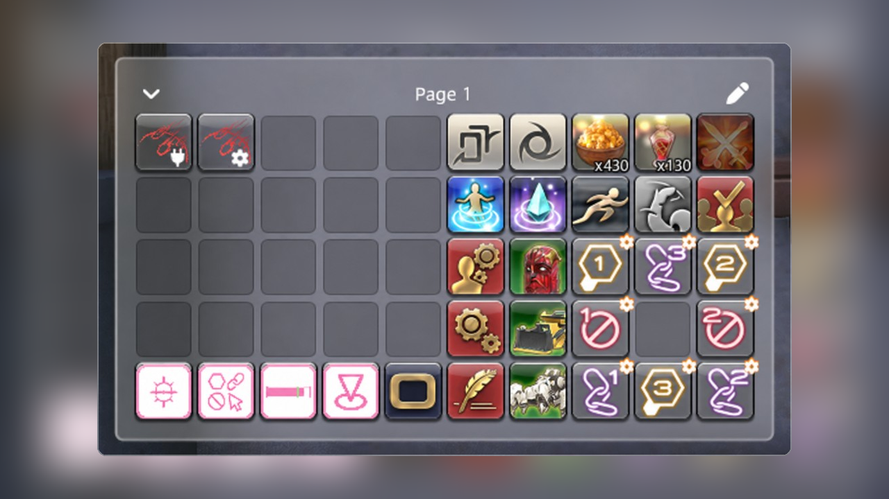

<p align="center">
  
</p>

<h1 align="center">Enhanced Quick Panel</h1>

<p align="center">
  <a href="../README.md">English</a> | 日本語
</p>

<p align="center">
  <a href="https://github.com/exatrines/EnhancedQuickPanel/releases/latest">
    
  </a>
  <a href="../CHANGELOG.md">
    
  </a>
  <a href="../LICENSE">
    
  </a>
</p>

<p align="center">
  
</p>

Enhanced Quick Panel は、ゲーム標準のネイティブクイックパネルの代わりに、カスタマイズ可能なオーバーレイを表示する Dalamud プラグインです。

スロットにはアクション・アイテム・マクロ・テキストコマンドを置けます。複数ページに分けて整理し、見た目も変えられます。編集中はホットバーやインベントリからドラッグできます。任意で、`/quickpanel` 実行時にネイティブパネルの代わりにオーバーレイを出せます。

設定画面のスクショや編集手順は [詳細マニュアル](document.en.md) を参照してください。

## インストール

1. `/xlsettings` を実行し、**試験的機能**タブを開く
2. **カスタムプラグインリポジトリ** に次の URL を追加する:

```
https://raw.githubusercontent.com/exatrines/DalamudPlugins/refs/heads/main/pluginmaster.json
```

3. `/xlplugins` を実行し、**Enhanced Quick Panel** をインストールする

## 機能

- **柔軟なスロット** — 各スロットにアクション・アイテム・マクロ・任意のテキスト／チャットコマンド
- **パネルサイズ** — ネイティブと同じ 5×5（1×1）から、最大 2×2 ブロックまで。サイズは全ページ共通
- **複数ページ** — クリックのポップアップやマウスホイールで切り替え
- **ドラッグ＆ドロップ編集** — ホットバーやインベントリからスロットへ。スロット同士のドラッグで入れ替え
- **アイコン選択** — ゲーム内アイコン、または URL から取り込んだ画像
- **ネイティブからインポート** — ゲーム標準のクイックパネルのページを取り込み
- **クリップボード共有** — パネル内容とスタイルをテキストとしてインポート／エクスポート
- **スタイルプリセット** — `White` / `Gray` / `Black`。色・サイズ・枠・オーバーレイ表示も個別に設定可能
- **ネイティブ置き換え** — `/quickpanel` 実行時に、任意でオーバーレイを表示
- **i18n** — 英語と日本語の UI

## コマンド

| コマンド | 説明 |
| --- | --- |
| `/enhancedquickpanel` | オーバーレイの表示切替 |
| `/enhancedquickpanel settings` | プラグイン設定の表示切替 |
| `/eqp` | `/enhancedquickpanel` のエイリアス |
| `/eqp settings` | `/enhancedquickpanel settings` のエイリアス |

## 開発者向け

1. `git submodule update --init --recursive`
2. ビルド: `dotnet build EnhancedQuickPanel.sln -c Release -p:Platform=x64`
3. Dalamud の **dev plugin** に `EnhancedQuickPanel/bin/Release/` を指定する
4. プラグインインストーラ（dev）で **Enhanced Quick Panel** を有効にする

共有 UI キットの [MirageUI](https://github.com/exatrines/MirageUI) を git サブモジュールとして同梱しています。

## コントリビューション

コントリビューションは大歓迎です！[貢献ガイド](../CONTRIBUTING.md)をご覧ください。
